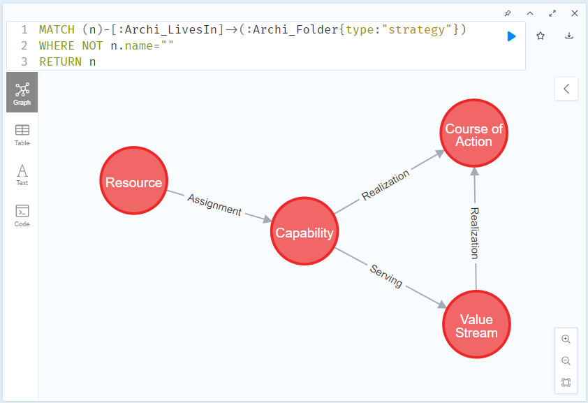
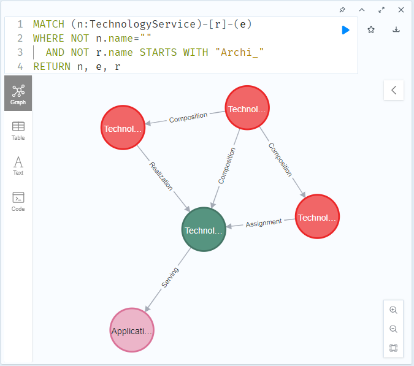

# The ArchiMate® Verifier

A solution that allows verification of ArchiMate® models
against validity statements
and formal data sets, e.g. exports from infrastructure services or business apps.

# Getting started

## Prerequisites

The examples provided below assume
that you have installed and configured
[Docker](https://docs.docker.com/compose/install/)
and [Docker Compose](https://docs.docker.com/compose/install/).

Clone this repository. Make sure that you have following folders and files
in your current folder.
~~~
compose.yaml
compose.ui.yaml
compose.git.yaml
examples/
verification_scripts/duplicate-element-names.cypher
verification_scripts/empty-view.cypher
verification_scripts/unused-elements.cypher
~~~

## Basic verifications

We are going to use _Archimate3.2 Reference sheets.archimate_ model by _RemcoSchellekensNS_.
<br/>Download it from
[here on GitHub](https://github.com/RemcoSchellekensNS/Archimate/blob/main/Archimate3.2%20Reference%20sheets.archimate).
<br/>Place the model file in _examples_ folder.

Run following command. 
~~~sh
ARCHI_FOLDER=./examples \
ARCHI_FILE="Archimate3.2 Reference sheets.archimate" \
docker compose run --rm neo4j
~~~

We expect it to produce output as the following.
~~~
Importing the Archimate model to Neo4j...
+--------------------+
| Imported elements: |
+--------------------+
| 165                |
+--------------------+
...

Executing verification scripts...
import/verification_scripts/duplicate-element-names.cypher
Error! Duplicate element names, Type, Name
"id-5b620626cb01470fa03cc24e69cfebf6", "ApplicationService", "dummy"
"id-906aee6b07e443fbbaeca8138c89baa2", "ApplicationService", "dummy"
...
"id-7e8ec9f4f0364a69b1d72ade21f8fa9b", "Artifact", "Artifact"
"id-90bc0d5f23b4479183896557f7a9779c", "Artifact", "Artifact"
"id-fdc89820d2da497493d2896399dc7917", "BusinessObject", "Business Object"
"id-9465b2c8e3484e6b97f9eff0cd16abe4", "BusinessObject", "Business Object"

import/verification_scripts/empty-view.cypher
import/verification_scripts/unused-elements.cypher
Verification completed
~~~

## Verify one of the models you have

Copy your model file to _examples_ folder,
or alternatively, modify ```ARCHI_FOLDER``` variable to point to your model files folder.
<br/>Modify ```ARCHI_FILE``` providing the model's file name.

## Analyze model using Neo4j's _Cypher Query Language_ (CQL) queries

Using the previous setup, run following command.
~~~sh
ARCHI_FOLDER=./examples \
ARCHI_FILE="Archimate3.2 Reference sheets.archimate" \
docker compose -f compose.yaml -f compose.ui.yaml run --rm --service-ports neo4j
~~~

After it's done and has outputted _Verification completed_,
open http://localhost:7474/ in the browser. This is _Neo4j Browser_'s UI.

Copy following CQL query,
then paste it to the UI,
then press _Ctrl-Enter_ to execute it.
~~~cypher
MATCH (n)-[:Archi_LivesIn]->(:Archi_Folder{type:"strategy"})
WHERE NOT n.name=""
RETURN n
~~~

With this query we ask it to find all ArchiMate _elements_
that reside in ArchiMate _folders_ of type _strategy_.
(In other words, all elements of _Strategy_ layer of the model.)
(We exclude all element that have empty name as
_Archimate3.2 Reference sheets.archimate_ model has some, and we are not interested in them.)

Query result should look like this.
 

Let's try some other query.
~~~cypher
MATCH (n:TechnologyService)-[r]-(e)
WHERE NOT n.name=""
  AND NOT r.name STARTS WITH "Archi_"
RETURN n, e, r
~~~
Semantics of this query is _Find all TechnologyService elements, and show all their relations_.



# Verify model against "the real world" 

In this example we are going to use model stored in _examples/aws-resources/model.archimate_ file
and list of S3 buckets, we pretend exist in our AWS account, in file _examples/aws-resources/aws-s3-buckets.csv_

(You can easily produce similar output by using following AWS CLI command.)
~~~sh 
aws s3api list-buckets --query "Buckets[].[Name]" --output text
~~~

Let's verify whether our model contains correct representation of the buckets.

~~~sh
ARCHI_FOLDER=./examples/aws-resources \
ARCHI_FILE=model.archimate \
ADDITIONAL_DATA_FOLDER=./examples/aws-resources/additional_data \
NEO4J_SCRIPTS_FOLDER=./examples/aws-resources/verification_scripts \
docker compose run --rm neo4j
~~~

This the output we expect from the verification run.
~~~
Executing verification scripts...
import/verification_scripts/00-import-data.cypher
Imported items from aws-s3-buckets.csv:
3
import/verification_scripts/01-verify-s3-buckets.cypher
Error!
"S3 bucket not represented in model:  yet_another_example_bucket"
"Model contains bucket that does not exist:  bucket-in-model"
Verification completed
~~~

# Usage

There are three things you leverage to control how this solution behaves:
(1) Compose YAML files;
(2) environment variables;
(3) Docker Compose's command line parameters.

## Compose files

```compose.yaml``` configures basic functionality. Always required. You either explicitly specify ```-f compose.yaml```, or provide no ```-f``` parameter letting Docker Compose to default to this file. (Read [this part of Docker Compose's documentation](https://docs.docker.com/compose/reference/#use--f-to-specify-name-and-path-of-one-or-more-compose-files).)

```compose.ui.yaml``` enables _Neo4j Browser_'s UI (It also requires providing ```--service-ports``` parameter. See below.)

```compose.git.yaml``` makes the solution read the model from Git repository rather than from _.archimate_ file. (It also requires providing ```GIT_*``` environment variables. See below.)

You can combine ```compose.ui.yaml``` and ```compose.git.yaml``` when you need both features.

In case you provide any of the non-default YAMLs, you need to include ```-f compose.yaml``` explicitly.
<br/>So, full syntax of ```-f``` part of _Docker_ command line looks like this. 
```
[-f compose.yaml [-f compose.ui.yaml] [-f compose.git.yaml] ]
```

## Environmant variables

```ARCHI_FOLDER``` Default value is ```.``` (current folder)
<br/>```ARCHI_FILE``` Default value is ```model.archimate```
<br/>The solution processes model file with this name you provide in this folder. 

```NEO4J_SCRIPTS_FOLDER``` Default value is ```./verification_scripts```
<br/>The solution runs CQL scripts it finds in this folder.
<br/>Regardless to the files' extensions, it treats all files in the folder as CQL scripts.
<br/>The folder can contain subfolders. All subfolders get processed recursively.
It runs the scripts one by one in alphabetical order of subfolder and file names. 

```ADDITIONAL_DATA_FOLDER``` Default value is ```./additional_data```
<br/>Additional data you make available to _Neo4j_ as files in as _import/additional_data_ directory.

(To make ```GIT_*``` variables come to effect, you need to enable support for Git as described above.) 

```GIT_URL``` Maps to  _--modelrepository.cloneModel_ parameter of the Archimate tool's CLI [described here](https://github.com/archimatetool/archi/wiki/Archi-Command-Line-Interface#:~:text=modelrepository).
<br/>```GIT_USER``` Maps to  _--modelrepository.userName_
<br/>```GIT_PASSWORD_FILES_FOLDER``` and ```GIT_PASSWORD_FILE``` map to  _--modelrepository.passFile_

There are several ways how you can provide environment variables to your _docker_ command.
Read this [part of _Docker Compose_'s documentation](https://docs.docker.com/compose/environment-variables/set-environment-variables/)

## Docker CLI parameters

It is recommended to us ```--rm``` parameter to automatically remove the neo4j container when it exits.

So, let's summarize command line syntax.
~~~
docker compose run [-f ...] [--service-ports] --rm neo4j
~~~

## Cleaning up temporary Docker volume

There is a volume this solution create. To remove it, run following command.
~~~sh
docker compose rm --volumes
~~~

# Roadmap
- [ ] Allow model analysis and verification using SQL queries.
